# GitHub Actions - Azure Container App Deployment Workflow

## 📋 Overview

This GitHub Actions workflow automates the complete CI/CD pipeline for deploying containerized applications to Azure Container Apps. It provides a secure, fully automated deployment process with built-in security scanning, vulnerability reporting, health checks, automatic rollback, and intelligent revision management.

### 🎯 Key Features

- **🔒 OIDC Authentication**: Secure, passwordless authentication to Azure using OpenID Connect
- **🐳 Docker Build & Push**: Automated Docker image building and pushing to Azure Container Registry (ACR)
- **🔍 Security Scanning**: Integrated Trivy vulnerability scanning with detailed reports
- **🤖 Auto-provisioning**: Automatic creation of ACR, ACR repositories, and Container Apps if they don't exist
- **🔐 Dynamic Secret Management**: Automatic injection of all GitHub secrets into Container Apps
- **✅ Health Checks**: Post-deployment health validation with automatic retry logic (10 attempts)
- **🔄 Automatic Rollback**: Intelligent rollback to previous stable revision on health check failures
- **🧹 Native Revision Management**: Azure-managed revision cleanup based on configured retention limit
- **📊 Detailed Reporting**: Vulnerability reports published as GitHub Issues and Security tab
- **🔔 Smart Notifications**: Automatic issue creation for rollbacks and scan results
- **🌍 Multi-environment Support**: Separate deployments for development and production

---

## 🔀 Workflow Execution Flow

### Sequential Execution Diagram

```mermaid
graph TD
    A[🚀 Workflow Trigger] --> B[🔨 Job 1: Build Docker Image]
    B --> C[🔍 Job 2: Scan Docker Image]
    C --> D[📦 Job 3: Push Docker Image]
    D --> E[⚙️ Job 4: Setup Azure Infrastructure]
    E --> F[🚀 Job 5: Deploy & Health Check]
    F --> G{Health Check<br/>Passed?}
    G -->|✅ Yes| H[✅ Deployment Complete]
    G -->|❌ No| I[🔄 Automatic Rollback]
    I --> J[📧 Create Rollback Issue]
    J --> K[❌ Deployment Failed<br/>Rolled Back]
    
    style A fill:#e1f5ff
    style B fill:#fff3cd
    style C fill:#d4edda
    style D fill:#cfe2ff
    style E fill:#f8d7da
    style F fill:#d1ecf1
    style G fill:#fff3cd
    style H fill:#d4edda
    style I fill:#f8d7da
    style J fill:#f8d7da
    style K fill:#f8d7da
```



### Detailed Stage Flow

```
┌─────────────────────────────────────────────────────────────────────────┐
│                    🚀 GITHUB ACTIONS WORKFLOW                            │
└─────────────────────────────────────────────────────────────────────────┘

📍 STAGE 1: BUILD IMAGE (~5-7 minutes)
┌─────────────────────────────────────────────────────────────────────────┐
│ ✓ Checkout code from repository                                         │
│ ✓ Set up Docker Buildx                                                  │
│ ✓ Azure OIDC authentication                                             │
│ ✓ Ensure ACR exists (auto-create if needed)                            │
│ ✓ Ensure ACR repository exists (auto-create if needed)                 │
│ ✓ Build Docker image (tagged with Git SHA)                             │
│ ✓ Save image as artifact                                                │
└─────────────────────────────────────────────────────────────────────────┘
                                    ↓
📍 STAGE 2: SCAN IMAGE (~2-3 minutes)
┌─────────────────────────────────────────────────────────────────────────┐
│ ✓ Download Docker image artifact                                        │
│ ✓ Install Trivy scanner                                                 │
│ ✓ Scan for vulnerabilities (CRITICAL, HIGH, MEDIUM, LOW)               │
│ ✓ Generate reports (JSON, SARIF, HTML, TXT)                            │
│ ✓ Upload SARIF to GitHub Security tab                                  │
│ ✓ Create GitHub Issue with vulnerability details                       │
│ ✓ Clean up local image                                                  │
└─────────────────────────────────────────────────────────────────────────┘
                                    ↓
📍 STAGE 3: PUSH IMAGE (~1-2 minutes)
┌─────────────────────────────────────────────────────────────────────────┐
│ ✓ Download Docker image artifact                                        │
│ ✓ Azure OIDC authentication                                             │
│ ✓ Login to ACR                                                          │
│ ✓ Push image to registry                                                │
│ ✓ Clean up local image                                                  │
└─────────────────────────────────────────────────────────────────────────┘
                                    ↓
📍 STAGE 4: SETUP INFRASTRUCTURE (~2-3 minutes)
┌─────────────────────────────────────────────────────────────────────────┐
│ ✓ Azure OIDC authentication                                             │
│ ✓ Ensure Container Apps Environment exists (auto-create)               │
│ ✓ Ensure Container App exists (auto-create with env suffix)            │
│ ✓ Inject all GitHub secrets dynamically                                 │
│ ✓ Set environment variables (ENVIRONMENT, APP_VERSION, etc.)           │
│ ✓ Update Container App with new image                                   │
└─────────────────────────────────────────────────────────────────────────┘
                                    ↓
📍 STAGE 5: DEPLOY & VERIFY (~2-3 minutes)
┌─────────────────────────────────────────────────────────────────────────┐
│ ✓ Azure OIDC authentication                                             │
│ ✓ Wait for deployment stabilization (20 seconds)                       │
│ ✓ Retrieve Container App URL                                            │
│ ✓ Execute health check (10 retries × 10 seconds)                       │
│                                                                          │
│   ┌──────────────────────────────┬──────────────────────────────┐      │
│   │   ✅ HEALTH CHECK PASSED      │   ❌ HEALTH CHECK FAILED      │      │
│   └──────────────────────────────┴──────────────────────────────┘      │
│                  ↓                              ↓                        │
│   ┌──────────────────────────────┐  ┌──────────────────────────────┐  │
│   │ ✅ DEPLOYMENT SUCCESSFUL      │  │ 🔄 AUTOMATIC ROLLBACK         │  │
│   │                               │  │ • Identify failed revision    │  │
│   │ Note: Revision cleanup is     │  │ • Find previous stable rev    │  │
│   │ handled automatically by      │  │ • Deactivate failed revision  │  │
│   │ Azure Container Apps based    │  │ • Activate stable revision    │  │
│   │ on the maxInactiveRevisions   │  │ • Route 100% traffic          │  │
│   │ setting (default: 6)          │  │ • Verify rollback health      │  │
│   │                               │  │ • Create rollback issue       │  │
│   │ Configured at app creation    │  │                               │  │
│   │ and persists across deploys   │  │ ❌ DEPLOYMENT FAILED          │  │
│   │                               │  │    (Rolled back to stable)    │  │
│   └──────────────────────────────┘  └──────────────────────────────┘  │
└─────────────────────────────────────────────────────────────────────────┘

⏱️ Total Execution Time: ~12-18 minutes (varies based on image size & complexity)
```

### Parallel vs Sequential Execution

**Current Implementation: Sequential**
```
Build → Scan → Push → Setup → Deploy
  ↓       ↓      ↓       ↓        ↓
  5m      3m     2m      2m       3m
Total: ~15 minutes
```

**Potential Parallel Optimization: (Future Enhancement)**
```
        Build (5m)
           ↓
    ┌──────┴──────┐
    ↓             ↓
  Scan (3m)    Setup (2m)
    └──────┬──────┘
           ↓
        Push (2m)
           ↓
       Deploy (3m)
       
Total: ~12 minutes (~20% improvement)
```


## 🚀 Workflow Stages

### Stage 1: 🔨 Build Docker Image
**Job:** `build-image`

**What it does:**
- Checks out your application code
- Sets up Docker Buildx for optimized builds
- Authenticates to Azure using OIDC
- **Auto-creates Azure Container Registry (ACR)** if it doesn't exist
- Builds Docker image with Git SHA as tag
- Saves Docker image as artifact for next stages

**Sample Output:**
```
🔍 Setting job outputs...
  IMAGE_TAG: a1b2c3d4e5f6g7h8i9j0
  IMAGE_NAME: myacr.azurecr.io/myapp/myservice
✅ Outputs set successfully
Building image: myacr.azurecr.io/myapp/myservice:a1b2c3d4e5f6g7h8i9j0
✅ Image saved to artifact
```


### Stage 2: 🔍 Scan Docker Image
**Job:** `scan-image`

**What it does:**
- Downloads the built Docker image artifact
- Installs Trivy security scanner
- Scans image for vulnerabilities (OS packages and application dependencies)
- Generates multiple report formats (JSON, SARIF, HTML, TXT)
- Uploads scan results to GitHub Security tab
- Creates a detailed GitHub Issue with vulnerability breakdown
- **Currently continues deployment regardless of vulnerability count** ⚠️

**Severity Levels Scanned:**
- CRITICAL
- HIGH  
- MEDIUM
- LOW

**Sample Output:**
```
### Security Scan Summary
- **Critical**: 3
- **High**: 12
- **Medium**: 45
- **Low**: 78

Report filed as issue #42 for build #123 (SHA a1b2c3d4e5f6g7h8i9j0)
```

**📝 Future Enhancement:**
> Currently, the workflow proceeds with deployment irrespective of vulnerability counts. In the future, this can be configured with a flag to block deployment when critical or high vulnerabilities are detected:
> ```yaml
> - name: Check vulnerability threshold
>   run: |
>     if [ "${{ steps.scan.outputs.critical }}" -gt 0 ]; then
>       echo "❌ Deployment blocked due to critical vulnerabilities"
>       exit 1
>     fi
> ```


### Stage 3: 📦 Push Docker Image
**Job:** `push-image`

**What it does:**
- Downloads the Docker image artifact
- Authenticates to Azure and ACR
- Pushes the Docker image to Azure Container Registry
- Cleans up local image to save space

**Sample Output:**
```
✅ Image pushed successfully: myacr.azurecr.io/myapp/myservice:a1b2c3d4e5f6g7h8i9j0
```


### Stage 4: ⚙️ Setup Azure Infrastructure
**Job:** `setup-infrastructure`

**What it does:**
- **Auto-creates Container Apps Environment** if it doesn't exist
- **Auto-creates Container App** with environment suffix (e.g., `myapp-development`)
- **Auto-creates ACR repository** if it doesn't exist in the ACR
- **Configures revision retention limit** on first creation (default: 6 revisions)
- Injects all GitHub secrets dynamically as Container App secrets
- Sets environment variables from secrets
- Updates Container App with new image

**Auto-Secret Injection Process:**
1. Reads all secrets from GitHub Environment
2. Converts secret names to Azure-compatible format (lowercase, hyphens)
3. Creates secrets in Container App
4. Maps secrets to environment variables
5. Adds metadata like `ENVIRONMENT` and `APP_VERSION`

**Sample Output:**
```
✅ Container Apps Environment already exists
⚠ Container App not found. Creating Container App with name: myapp-development
✅ Container App myapp-development created successfully

ℹ️ REVISION_RETENTION_LIMIT not set, using default: 6
📋 Revision retention limit: 6
🔧 Setting revision retention limit to: 6
📋 Revision limit configured (automatic cleanup enabled)

total secrets: 15
✅ Mapped DATABASE_URL → database-url (env: DATABASE_URL)
✅ Mapped API_KEY → api-key (env: API_KEY)
✅ Mapped AZURE_CLIENT_ID → azure-client-id (env: AZURE_CLIENT_ID)
📦 Secret tokens count: 15
📦 Env var tokens count: 17
🚀 Setting secrets in Container App…
✅ Secrets configured.
🔧 Setting env vars in Container App…
✅ Env vars configured.
```


### Stage 5: 🚀 Deploy & Health Check
**Job:** `deploy-and-verify`

**What it does:**
- Waits for deployment stabilization (20 seconds cooldown)
- Retrieves the Container App FQDN (URL)
- Performs health check with configurable endpoint and expected status
- Retries up to 10 times with 10-second intervals
- **Automatic rollback on health check failure**
- **Note:** Revision cleanup is handled natively by Azure Container Apps based on the `maxInactiveRevisions` setting configured during app creation

**Sample Output - Successful Deployment:**
```
Container App URL: https://myapp-development.azurecontainerapps.io
Starting health check for: https://myapp-development.azurecontainerapps.io/health
Attempt 1/10...
✅ Health check passed! Status code: 200

✅ Deployment successful!
Note: Azure Container Apps will automatically manage revision cleanup based on the configured limit (6 revisions)
```

**Sample Output - Failed Deployment with Rollback:**
```
Starting health check for: https://myapp-development.azurecontainerapps.io/health
Attempt 1/10...
⚠️ Health check failed. Expected 200, got 500
Attempt 2/10...
⚠️ Health check failed. Expected 200, got 500
...
❌ Health check failed after 10 attempts

❌ Health check failed for myapp-development
🔄 Initiating automatic rollback...
📍 Current failed revision: myapp-development--abc123
🔙 Rolling back to previous revision: myapp-development--xyz789
✅ Rollback completed successfully!
📊 Previous revision myapp-development--xyz789 is now active with 100% traffic

🔍 Verifying rollback health...
✅ Rollback health check passed! Status: 200
🎉 Application successfully rolled back to stable version

📧 Rollback notification issue created: #123
```


## 🔐 OIDC Authentication Approach

### What is OIDC?

**OpenID Connect (OIDC)** is a modern authentication protocol that allows GitHub Actions to authenticate to Azure without storing long-lived credentials (passwords, service principal secrets). Instead, it uses short-lived tokens that are automatically issued and verified.

### Benefits of OIDC

✅ **No Secret Storage**: No need to store Azure credentials in GitHub Secrets  
✅ **Short-lived Tokens**: Tokens expire automatically (typically within hours)  
✅ **Better Security**: Reduces risk of credential leakage  
✅ **Automatic Rotation**: No manual credential rotation needed  
✅ **Audit Trail**: Better tracking of authentication events in Azure AD  
✅ **Least Privilege**: Can restrict access based on repository, branch, or environment

### How We Established OIDC

#### 1. **Azure Side Configuration**

Created a **Federated Identity Credential** in Azure AD:

```bash
# Create App Registration
az ad app create --display-name "GitHub-Actions-OIDC"

# Create Service Principal
az ad sp create --id <APP_ID>

# Add Federated Credential
az ad app federated-credential create \
  --id <APP_ID> \
  --parameters '{
    "name": "GitHub-Actions-Federated",
    "issuer": "https://token.actions.githubusercontent.com",
    "subject": "repo:<org-name>/gha-azcapp:environment:development",
    "audiences": ["api://AzureADTokenExchange"]
  }'

# Assign permissions to subscription
az role assignment create \
  --assignee <APP_ID> \
  --role Contributor \
  --scope /subscriptions/<SUBSCRIPTION_ID>
```

#### 2. **GitHub Actions Workflow Configuration**

Added OIDC permissions and authentication:

```yaml
permissions:
  id-token: write  # Required for OIDC token request
  contents: read
  
- name: Azure Login
  uses: azure/login@v2
  with:
    client-id: ${{ secrets.AZURE_CLIENT_ID }}
    tenant-id: ${{ secrets.AZURE_TENANT_ID }}
    subscription-id: ${{ secrets.AZURE_SUBSCRIPTION_ID }}
    # No password/secret needed!
```

#### 3. **Trust Relationship**

The federated credential establishes trust between:
- **GitHub Actions** (issuer: `https://token.actions.githubusercontent.com`)
- **Your Repository** (subject: `repo:OWNER/REPO:environment:ENV`)
- **Azure AD** (audience: `api://AzureADTokenExchange`)

When the workflow runs:
1. GitHub Actions requests an OIDC token from GitHub
2. The token contains claims about the workflow (repo, environment, etc.)
3. Azure validates the token against the federated credential
4. Azure issues a short-lived access token
5. Workflow uses the access token to authenticate Azure CLI/API calls


## 📝 Workflow Inputs

The workflow supports manual triggering via `workflow_dispatch` with the following inputs:

### `branch_name`
- **Description**: Enter the Branch name
- **Required**: ✅ Yes
- **Default**: `main`
- **Example**: `main`, `develop`, `feature/new-api`

### `environment`
- **Description**: Deployment environment
- **Required**: ✅ Yes
- **Default**: `development`
- **Type**: Choice (dropdown)
- **Options**:
  - `development`
  - `production`

**Usage:**
- Determines which GitHub Environment secrets/variables to use
- Appends environment suffix to Container App name (e.g., `myapp-development`)
- Allows environment-specific configurations


## 🔑 Mandatory Environment Variables & Secrets

### 🔴 Required Secrets

These secrets MUST be configured in your GitHub repository under **Settings → Environments → [environment-name] → Secrets**:

| Secret Name | Description | Where to Get It | Example |
|------------|-------------|-----------------|---------|
| `AZURE_CLIENT_ID` | Azure AD App Registration Client ID (for OIDC) | Azure Portal → App Registrations → Your App → Overview → Application (client) ID | `a1b2c3d4-e5f6-g7h8-i9j0-k1l2m3n4o5p6` |
| `AZURE_TENANT_ID` | Azure AD Tenant ID | Azure Portal → Azure Active Directory → Overview → Tenant ID | `f6e5d4c3-b2a1-0987-6543-210fedcba987` |
| `AZURE_SUBSCRIPTION_ID` | Azure Subscription ID where resources will be created | Azure Portal → Subscriptions → Your Subscription → Subscription ID | `12345678-90ab-cdef-1234-567890abcdef` |
| `AZURE_RESOURCE_GROUP` | Azure Resource Group name | Create in Azure Portal or use existing: `az group create -n myapp-rg -l eastus` | `myapp-rg` |
| `REG_ID` | Azure User-Assigned Managed Identity resource ID for ACR access | Azure Portal → Managed Identities → Your Identity → Properties → Resource ID | `/subscriptions/xxx/resourceGroups/xxx/providers/Microsoft.ManagedIdentity/userAssignedIdentities/myidentity` |

### 🟢 Required Variables

These variables MUST be configured in your GitHub repository under **Settings → Environments → [environment-name] → Variables**:

| Variable Name | Description | Where to Get It | Example |
|--------------|-------------|-----------------|---------|
| `ACR_NAME` | Azure Container Registry name (globally unique) | Create new or use existing: `az acr create -n myacr -g myapp-rg --sku Basic` | `myacr` |
| `ACR_REPOSITORY` | Repository path within ACR | Your choice - represents app grouping | `myapp` or `backend/api` |
| `APP_NAME` | Application/service name | Your choice - service identifier | `user-service` |
| `CONTAINER_APP_ENVIRONMENT` | Container Apps Environment name | Will be auto-created if doesn't exist | `myapp-env` |
| `CONTAINER_APP_NAME` | Base name for Container App (env suffix added automatically) | Your choice - base app name | `myapp` (becomes `myapp-development`) |
| `TRIVY_SEVERITY_THRESHOLD` | Comma-separated severity levels to scan | Default: `CRITICAL,HIGH,MEDIUM,LOW` | `CRITICAL,HIGH` |
| `HEALTH_CHECK` | Health check endpoint path (without leading slash) | Your app's health endpoint | `health` or `api/health` |
| `HEALTH_CHECK_EXPECTED_STATUS` | Expected HTTP status code for successful health check | Usually `200` or `204` | `200` |
| `LOG_LEVEL` | (Optional) Application log level | Your preference | `info`, `debug`, `error` |
| `REVISION_RETENTION_LIMIT` | (Optional) Number of inactive revisions to retain (configured at app creation) | Default: `6` | `6`, `10`, `15` |


## 🔒 Auto-Adding Secrets Approach

### How It Works

The workflow includes an **innovative dynamic secret injection mechanism** that automatically propagates ALL GitHub secrets to your Container App:

```yaml
- name: Inject all secrets dynamically
  env:
    SECRETS_JSON: ${{ toJSON(secrets) }}
  run: |
    # Iterate through all secrets
    mapfile -t SECRET_KEYS < <(echo "$SECRETS_JSON" | jq -r 'keys[]')
    
    for SECRET_NAME in "${SECRET_KEYS[@]}"; do
      # Convert SECRET_NAME to Azure-compatible format
      AZURE_SECRET_NAME=$(echo "$SECRET_NAME" | tr '[:upper:]' '[:lower:]' | tr '_' '-')
      
      # Map secret to environment variable
      ENV_VAR_NAME=$(echo "$SECRET_NAME" | tr '[:lower:]' '[:upper:]')
      
      # Add to Container App
      SECRET_TOKENS+=("${AZURE_SECRET_NAME}=${SECRET_VALUE}")
      ENVVAR_TOKENS+=("${ENV_VAR_NAME}=secretref:${AZURE_SECRET_NAME}")
    done
    
    # Bulk set secrets
    az containerapp secret set --secrets "${SECRET_TOKENS[@]}"
    az containerapp update --set-env-vars "${ENVVAR_TOKENS[@]}"
```

### Benefits

✅ **Zero Configuration**: Add new secrets in GitHub, they're automatically available in your app  
✅ **No Hardcoding**: No need to list secrets explicitly in workflow  
✅ **Maintainability**: Add/remove secrets without updating workflow code  
✅ **Consistency**: All environments get same secret structure  
✅ **Security**: Secrets never appear in logs (Azure CLI handles redaction)  
✅ **Flexibility**: Works with any number of secrets

### Example Transformation

| GitHub Secret | Azure Secret | Container App Env Var |
|--------------|--------------|---------------------|
| `DATABASE_URL` | `database-url` | `DATABASE_URL` |
| `API_KEY_STRIPE` | `api-key-stripe` | `API_KEY_STRIPE` |
| `OAUTH_CLIENT_SECRET` | `oauth-client-secret` | `OAUTH_CLIENT_SECRET` |

### Additional Auto-Injected Variables

The workflow also automatically injects:
- `ENVIRONMENT`: Current environment name (development/production)
- `APP_VERSION`: Git commit SHA for version tracking
- `LOG_LEVEL`: If defined in GitHub Variables


## 🛡️ Security Pointers

### 1. **OIDC Authentication** 🔐
- ✅ No long-lived credentials stored in GitHub
- ✅ Short-lived tokens (typically 1 hour)
- ✅ Federated trust with Azure AD
- ✅ Scoped to specific repository and environment

### 2. **Least Privilege Access** 👮
- ✅ Service Principal has only necessary Azure RBAC roles
- ✅ Container App identity uses User-Assigned Managed Identity
- ✅ ACR access via Managed Identity (no admin credentials)

### 3. **Secret Management** 🔑
- ✅ GitHub Environment-specific secrets (dev vs prod isolation)
- ✅ Secrets stored in Azure Container App secret store (encrypted at rest)
- ✅ Secret references in environment variables (not plain text)
- ✅ No secrets logged in workflow output

### 4. **Vulnerability Scanning** 🔍
- ✅ Trivy scans all OS and application dependencies
- ✅ Multiple severity levels tracked (CRITICAL, HIGH, MEDIUM, LOW)
- ✅ Results published to GitHub Security tab (SARIF format)
- ✅ Detailed reports created as GitHub Issues
- ✅ Scan artifacts retained for audit

**Current Behavior:**
- ⚠️ Deployment proceeds regardless of vulnerability count
- ℹ️ Vulnerabilities are reported but don't block deployment

**Future Enhancement:**
```yaml
# Add this step to block deployment on critical vulnerabilities
- name: Enforce vulnerability policy
  run: |
    if [ "${{ steps.scan.outputs.critical }}" -gt 0 ]; then
      echo "❌ CRITICAL vulnerabilities detected: ${{ steps.scan.outputs.critical }}"
      echo "Deployment blocked by security policy"
      exit 1
    fi
```

### 5. **Container Registry Security** 🐳
- ✅ ACR access via Azure Managed Identity
- ✅ No registry passwords stored
- ✅ Images tagged with Git SHA (immutable, traceable)
- ✅ Registry SKU supports vulnerability scanning

### 6. **Network Security** 🌐
- ✅ Container Apps use HTTPS ingress by default
- ✅ Internal-only services can be configured (change ingress type)
- ✅ Environment isolation (separate Container App per environment)

### 7. **Audit & Compliance** 📋
- ✅ All deployments tracked via GitHub Actions logs
- ✅ Git SHA embedded in image tags and environment variables
- ✅ Health check validation before marking deployment successful
- ✅ Trivy scan results stored as artifacts (90-day retention configurable)
- ✅ GitHub Issues created for vulnerability tracking

### 8. **Workflow Permissions** ⚙️
```yaml
permissions:
  contents: read          # Read repository code
  issues: write           # Create vulnerability issues
  security-events: write  # Upload SARIF to Security tab
  id-token: write         # Request OIDC token
  packages: write         # Push to registries
  actions: read           # Read workflow metadata
```
- ✅ Minimal permissions granted
- ✅ No write access to code
- ✅ Isolated environment execution

### 9. **Docker Build Security** 🏗️
- ✅ BuildKit used for optimized, cached builds
- ✅ Multi-stage builds recommended (reduces attack surface)
- ✅ Images saved as artifacts (not exposed publicly)
- ✅ Image cleanup after push (no local remnants)

### 10. **Rollback Capability** 🔄
- ✅ Automatic health check failure detection
- ✅ Automatic rollback to previous stable revision
- ✅ Traffic re-routing to stable version (100%)
- ✅ Post-rollback health verification
- ✅ GitHub Issue creation for rollback notifications
- ✅ Detailed rollback summary in workflow output
- ⚠️ Note: Secrets are NOT rolled back automatically (container images only)

**Rollback Process:**
```yaml
# Automatic rollback on health check failure
1. Detect health check failure (after 10 retries)
2. Identify current failed revision
3. Find previous stable revision
4. Deactivate failed revision
5. Activate previous revision
6. Route 100% traffic to stable version
7. Verify rollback health
8. Create notification issue
9. Exit with failure status
```

### 11. **Revision History Management** 📚
- ✅ Configurable revision retention limit (default: 6)
- ✅ Set at container app creation via `maxInactiveRevisions` property
- ✅ Azure automatically manages revision cleanup
- ✅ Protection of active revisions with traffic
- ✅ No manual cleanup steps required in CI/CD pipeline

**Native Azure Management:**
```yaml
# Configured during container app creation
az containerapp create \
  --name myapp-development \
  ...
  # After creation, configure retention
  
az containerapp update \
  --name myapp-development \
  --set properties.configuration.activeRevisionsMode=multiple \
  --set properties.configuration.maxInactiveRevisions=6
```

**How It Works:**
1. Revision limit configured during first container app creation
2. Setting persists across all future deployments
3. Azure automatically deactivates old inactive revisions
4. Active revisions with traffic are always protected
5. No workflow steps needed for cleanup

**Benefits:**
- Native Azure feature (no custom scripts)
- Persistent configuration (survives deployments)
- Automatic management (no manual intervention)
- Reliable and consistent behavior


## 📊 Sample Outputs

### Successful Deployment

```
🔨 Build Docker Image
├─ ✅ Image tag: a1b2c3d4e5f6g7h8i9j0
├─ ✅ Image name: myacr.azurecr.io/myapp/user-service
└─ ✅ Image saved as artifact

🔍 Scan Docker Image
├─ ✅ Trivy installed
├─ ✅ Vulnerability scan completed
├─ 📊 Critical: 2, High: 8, Medium: 23, Low: 45
├─ ✅ SARIF uploaded to Security tab
└─ ✅ Issue #42 created with full report

📦 Push Docker Image
├─ ✅ ACR login successful
├─ ✅ Image pushed: myacr.azurecr.io/myapp/user-service:a1b2c3d4e5f6g7h8i9j0
└─ ✅ Local image cleaned up

⚙️ Setup Azure Infrastructure
├─ ✅ Container Apps Environment exists
├─ ⚠️  Container App not found - creating...
├─ ✅ Container App 'myapp-development' created
├─ ✅ 15 secrets configured
├─ ✅ 17 environment variables set
└─ ✅ Image updated

🚀 Deploy & Health Check
├─ 🌐 URL: https://myapp-development.azurecontainerapps.io
├─ ⏳ Waiting 20s for deployment...
├─ 🏥 Health check attempt 1/10...
├─ ✅ Health check passed! (Status: 200)
└─ ✅ Deployment successful!

Note: Azure Container Apps automatically manages revision cleanup based on configured limit (6 revisions)
```

### Vulnerability Report (GitHub Issue)

```markdown
# Trivy Scan Report - Build #123

Commit: a1b2c3d4e5f6g7h8i9j0k1l2m3n4o5p6q7r8s9t0
Generated: 2025-11-22T10:30:45Z

Image: myacr.azurecr.io/myapp/user-service

## CRITICAL (2)
| ID | Package | Installed | Fixed | Title | Source |
| --- | --- | --- | --- | --- | --- |
| CVE-2024-1234 | openssl | 1.1.1k | 1.1.1l | OpenSSL vulnerability... | image |
| CVE-2024-5678 | libcurl | 7.68.0 | 7.71.0 | Curl remote code execution | image |

## HIGH (8)
| ID | Package | Installed | Fixed | Title | Source |
| --- | --- | --- | --- | --- | --- |
| CVE-2024-9012 | nginx | 1.18.0 | 1.20.1 | Nginx buffer overflow | image |
...

## MEDIUM (23)
...

## LOW (45)
...
```


## � Secrets-Only Update Workflow

For scenarios where you need to **update secrets without redeploying code**, a separate lightweight workflow is available.

### When to Use

✅ **Use secrets-only update when:**
- Rotating credentials (database passwords, API keys)
- Updating configuration values
- Emergency secret changes
- No code changes required

❌ **Use main deployment workflow when:**
- Code changes exist
- New features or bug fixes
- Docker image needs rebuilding
- Full deployment cycle required

### Quick Comparison

| Aspect | Main Deployment | Secrets Update |
|--------|----------------|----------------|
| **Duration** | ~12-18 minutes | ~1-2 minutes |
| **Docker Build** | ✅ Yes | ❌ No |
| **Security Scan** | ✅ Yes | ❌ No |
| **Image Push** | ✅ Yes | ❌ No |
| **Secret Update** | ✅ Yes | ✅ Yes |
| **App Restart** | ✅ Yes | ⚙️ Optional |
| **Downtime** | ~30 seconds | 0-30 seconds |

### Workflow Features

The secrets-only update workflow (`update-secrets.yaml`) includes:

1. **🔐 Secret Injection**
   - Reads all GitHub Environment secrets
   - Auto-injects to Container App
   - Skips Azure authentication secrets

2. **⚙️ Optional Restart**
   - Choose whether to restart app
   - Minimal downtime if restart chosen
   - Manual restart option available

3. **💾 Automatic Backup**
   - Backs up current secrets before update
   - Stored as workflow artifact (7 days)
   - Useful for rollback scenarios

4. **✅ Health Verification**
   - Optional health check after restart
   - Validates secret updates
   - Early failure detection

5. **📊 Detailed Reporting**
   - Shows updated secrets count
   - Provides restart commands
   - Creates summary in GitHub UI

### Usage Example

```bash
# Scenario: Database password rotation

1. Update password in database
2. Update GitHub secret: DATABASE_PASSWORD
3. Run "Update Container App Secrets Only" workflow
4. Select environment: production
5. Choose restart: true ✅
6. Verify health check passes
```

### Sample Output

```
🔐 Starting secret injection process...
📦 Total GitHub secrets available: 15

✅ Mapped: DATABASE_URL → database-url (env: DATABASE_URL)
✅ Mapped: API_KEY → api-key (env: API_KEY)
⏭️  Skipping Azure auth secret: AZURE_CLIENT_ID

📊 Secret Processing Summary:
  - Total GitHub secrets: 15
  - Processed for injection: 12
  - Skipped (auth/empty): 3

🚀 Updating Container App secrets...
✅ Secrets updated successfully

🔄 Restarting Container App...
✅ Container App restarted successfully

🔍 Running health check...
✅ Health check passed! Status: 200
```

### Configuration

**Workflow Inputs:**
- `environment`: Target environment (development/production)
- `restart_app`: Restart after update? (true/false)

**No additional variables needed** - uses same GitHub Environment configuration as main workflow.

### Best Practices

✅ **DO:**
- Test in development first
- Use restart for critical secrets
- Verify health check after restart
- Keep secret backups

❌ **DON'T:**
- Skip testing in lower environments
- Ignore health check failures
- Update production without backup plan
- Delete backup artifacts immediately

### Troubleshooting

**Issue:** Health check fails after secret update

**Solution:**
1. Check if secret value is correct
2. Verify application reads secrets properly
3. Review Container App logs
4. Consider rolling back secret values

**Rollback Steps:**
```bash
# Option 1: Restore old values in GitHub and re-run workflow
1. Update GitHub secrets with old values
2. Run workflow with restart_app: true

# Option 2: Use backup artifact
1. Download secrets-backup artifact from workflow
2. Review previous secret configuration
3. Restore values manually
```

For complete documentation, see: `.github/workflows/update-secrets.yaml`


## �🚦 Getting Started

### Prerequisites

1. **Azure Account** with active subscription
2. **GitHub Repository** with code to deploy
3. **Self-hosted GitHub Runner** (labeled `gha-azcapp`) with Docker installed
4. **Azure CLI** installed on runner

### Setup Steps

#### 1. Configure Azure OIDC

```bash
# Create App Registration
APP_ID=$(az ad app create --display-name "GitHub-Actions-OIDC" --query appId -o tsv)

# Create Service Principal
az ad sp create --id $APP_ID

# Add Federated Credential for development
az ad app federated-credential create --id $APP_ID --parameters '{
  "name": "GitHub-Dev",
  "issuer": "https://token.actions.githubusercontent.com",
  "subject": "repo:YOUR_ORG/YOUR_REPO:environment:development",
  "audiences": ["api://AzureADTokenExchange"]
}'

# Add Federated Credential for production
az ad app federated-credential create --id $APP_ID --parameters '{
  "name": "GitHub-Prod",
  "issuer": "https://token.actions.githubusercontent.com",
  "subject": "repo:YOUR_ORG/YOUR_REPO:environment:production",
  "audiences": ["api://AzureADTokenExchange"]
}'

# Assign Contributor role
SUBSCRIPTION_ID=$(az account show --query id -o tsv)
az role assignment create \
  --assignee $APP_ID \
  --role Contributor \
  --scope /subscriptions/$SUBSCRIPTION_ID
```

#### 2. Create Managed Identity for ACR

```bash
# Create user-assigned managed identity
az identity create -g myapp-rg -n myapp-acr-identity

# Get identity resource ID
IDENTITY_ID=$(az identity show -g myapp-rg -n myapp-acr-identity --query id -o tsv)

# Assign AcrPull role to identity (after ACR is created)
ACR_ID=$(az acr show -n myacr --query id -o tsv)
az role assignment create \
  --assignee-object-id $(az identity show -g myapp-rg -n myapp-acr-identity --query principalId -o tsv) \
  --role AcrPull \
  --scope $ACR_ID
```

#### 3. Configure GitHub Secrets

In your repository: **Settings → Environments → development → Secrets**

Add:
- `AZURE_CLIENT_ID`: From step 1
- `AZURE_TENANT_ID`: Your Azure tenant ID
- `AZURE_SUBSCRIPTION_ID`: Your subscription ID
- `AZURE_RESOURCE_GROUP`: Your resource group name
- `REG_ID`: Identity resource ID from step 2

Add any application-specific secrets (they'll be auto-injected):
- `DATABASE_URL`
- `API_KEY`
- `OAUTH_SECRET`
- etc.

#### 4. Configure GitHub Variables

In your repository: **Settings → Environments → development → Variables**

Add:
- `ACR_NAME`: Your ACR name (e.g., `myacr`)
- `ACR_REPOSITORY`: Repository path (e.g., `myapp`)
- `APP_NAME`: Service name (e.g., `user-service`)
- `CONTAINER_APP_ENVIRONMENT`: Environment name (e.g., `myapp-env`)
- `CONTAINER_APP_NAME`: Base app name (e.g., `myapp`)
- `TRIVY_SEVERITY_THRESHOLD`: `CRITICAL,HIGH,MEDIUM,LOW`
- `HEALTH_CHECK`: `health`
- `HEALTH_CHECK_EXPECTED_STATUS`: `200`

#### 5. Add Workflow File

Copy `github-actions.yaml` to `.github/workflows/` in your repository.

#### 6. Run Workflow

1. Go to **Actions** tab in your repository
2. Select "Github Action Azure Container App Deployment"
3. Click **Run workflow**
4. Select branch and environment
5. Click **Run workflow**


## � Automatic Rollback & Revision Management

### Automatic Rollback Feature

The workflow includes **intelligent automatic rollback** that activates when health checks fail after deployment:

#### How It Works

1. **Health Check Monitoring**: After deployment, the workflow performs up to 10 health check attempts (100 seconds total)
2. **Failure Detection**: If all health checks fail, the rollback process automatically initiates
3. **Revision Identification**: 
   - Identifies the current failed revision
   - Locates the previous stable revision
4. **Traffic Switching**:
   - Deactivates the failed revision
   - Activates the previous stable revision
   - Routes 100% traffic to the stable version
5. **Verification**: Runs health checks on the rolled-back version
6. **Notification**: Creates a GitHub Issue with full rollback details

#### Rollback Example

```bash
# When health check fails:
❌ Health check failed for myapp-development
🔄 Initiating automatic rollback...

📍 Current failed revision: myapp-development--abc123-2024
🔙 Rolling back to previous revision: myapp-development--xyz789-2024

# Executing rollback:
az containerapp revision deactivate --revision myapp-development--abc123-2024
az containerapp revision activate --revision myapp-development--xyz789-2024
az containerapp ingress traffic set --revision-weight myapp-development--xyz789-2024=100

✅ Rollback completed successfully!
📊 Previous revision myapp-development--xyz789-2024 is now active with 100% traffic

# Verification:
🔍 Verifying rollback health...
✅ Rollback health check passed! Status: 200
🎉 Application successfully rolled back to stable version
```

#### Important Notes

⚠️ **Secrets Are NOT Rolled Back**
- Container images and traffic are rolled back automatically
- Secrets remain at the updated state (Azure security limitation)
- If configuration mismatch occurs, manual secret verification may be needed

✅ **First Deployment Handling**
- If no previous revision exists (first deployment), rollback is skipped
- Manual intervention required in this case

#### Rollback Notification

When rollback occurs, an automatic GitHub Issue is created with:
- Environment and application details
- Failed commit SHA
- Workflow run link
- Application logs command
- Detailed action items for fixing the issue
- Health check configuration details

**Issue Labels:**
- `deployment-failure`
- `auto-rollback`
- Environment name (e.g., `development`, `production`)


### Revision History Management

To prevent unlimited revision accumulation, the workflow automatically manages revision history:

#### Configuration

Set the `REVISION_RETENTION_LIMIT` variable in GitHub:
- **Location**: Settings → Environments → [environment] → Variables
- **Variable Name**: `REVISION_RETENTION_LIMIT`
- **Default Value**: `6` (if not set)
- **Recommended Values**: 5-10 revisions

#### How It Works

After a **successful deployment**, the cleanup process:

1. **Checks Revision Count**: Lists all revisions sorted by creation time
2. **Compares to Limit**: If count exceeds `REVISION_RETENTION_LIMIT`, cleanup starts
3. **Protects Active Revisions**: Skips any revision currently receiving traffic
4. **Deactivates Old Revisions**: Deactivates the oldest revisions beyond the limit
5. **Azure Auto-Cleanup**: Azure automatically removes inactive revisions after some time
6. **Reports Summary**: Provides detailed cleanup summary in workflow output

#### Cleanup Example

```bash
🧹 Starting revision cleanup for myapp-development...
📋 Revision retention limit: 6
📊 Total revisions found: 10

⚠️ Revision count (10) exceeds limit (6)
🗑️ Will deactivate 4 old revision(s)...

🗑️ Processing revision: myapp-development--rev1
  ✅ Revision deactivated: myapp-development--rev1
🗑️ Processing revision: myapp-development--rev2
  ✅ Revision deactivated: myapp-development--rev2
🗑️ Processing revision: myapp-development--rev3
  ✅ Revision deactivated: myapp-development--rev3
🗑️ Processing revision: myapp-development--rev4
  ⚠️ Skipping active revision with traffic: myapp-development--rev4 (Traffic: 50%)

✅ Revision cleanup completed!
📊 Summary:
  - Total revisions before: 10
  - Retention limit: 6
  - Revisions deactivated: 3
  - Active revisions kept: 7 (1 with traffic protection)

📋 Current active revisions:
Name                              Created              Active  Traffic
myapp-development--abc123-2024   2024-11-23T10:30:00  True    100
myapp-development--xyz789-2024   2024-11-22T15:20:00  True    0
myapp-development--def456-2024   2024-11-21T09:10:00  True    0
...
```

#### Benefits

✅ **Cost Optimization**: Reduces resource consumption from unused revisions  
✅ **Performance**: Faster listing and management of revisions  
✅ **Maintenance**: Keeps the revision list clean and manageable  
✅ **Safety**: Protects active revisions and those receiving traffic  
✅ **Flexibility**: Configurable per environment  

#### Cleanup Timing

- **When**: After successful deployment and health check
- **Condition**: Only runs if deployment succeeds (`if: success()`)
- **Frequency**: Every successful deployment
- **Duration**: Typically 10-30 seconds depending on revision count


## �🔧 Troubleshooting

### Common Issues

#### 1. OIDC Authentication Failed
```
Error: AADSTS70021: No matching federated identity record found
```
**Solution**: Verify federated credential subject matches exactly:
```
repo:YOUR_ORG/YOUR_REPO:environment:ENVIRONMENT_NAME
```

#### 2. ACR Access Denied
```
Error: unauthorized: authentication required
```
**Solution**: 
- Ensure managed identity has `AcrPull` role
- Verify `REG_ID` is correct in secrets
- Check ACR admin account is enabled (for first-time setup)

#### 3. Health Check Fails
```
❌ Health check failed after 10 attempts
```
**Solution**:
- Verify `HEALTH_CHECK` path is correct (no leading slash)
- Check application logs: `az containerapp logs show`
- Ensure app exposes port 8080
- Verify `HEALTH_CHECK_EXPECTED_STATUS` matches your endpoint

#### 4. Container App Creation Fails
```
Error: The resource group 'xxx' does not exist
```
**Solution**: Create resource group first:
```bash
az group create -n myapp-rg -l eastus
```

#### 5. Rollback Fails - No Previous Revision
```
⚠️ No previous revision found to rollback to!
ℹ️ This might be the first deployment. Manual intervention required.
```
**Solution**: 
- This is expected for first-time deployments
- Check application logs to debug the issue:
```bash
az containerapp logs show -n myapp-development -g myapp-rg --follow
```
- Fix the issue and redeploy

#### 6. Rollback Succeeds But App Still Unhealthy
```
⚠️ Rollback health check returned: 500
⚠️ Manual intervention may be required
```
**Solution**:
- Check if secrets were updated and causing mismatch with old code
- Verify previous revision configuration:
```bash
az containerapp revision show -n myapp-development--<revision-name> -g myapp-rg
```
- Manually revert secrets if needed
- Consider implementing Key Vault-based secret versioning

#### 7. Revision Cleanup Fails
```
Error: Cannot deactivate active revision with traffic
```
**Solution**:
- This is expected - revisions with traffic are protected
- Wait for traffic to shift to newer revision
- Azure will auto-cleanup inactive revisions eventually


## 🚀 Future Enhancements

### 1. Parallel Job Execution

**Current State:** Jobs execute sequentially, with each job waiting for the previous one to complete.

**Proposed Optimization:** Execute independent jobs in parallel to reduce overall workflow execution time.

#### Optimization Strategy


**Key Changes:**
- **Scan Image** and **Setup Infrastructure** run in parallel after **Build Image**
- Both must complete before **Push Image** begins
- Expected improvement: **~20% faster execution time**

**Benefits:**
- ✅ Reduced time to deployment
- ✅ Better resource utilization
- ✅ Faster feedback on failures
- ✅ No compromise on security or quality

**Implementation Considerations:**
```yaml
# Scan and Setup can run in parallel
scan-image:
  needs: [build-image]  # Only depends on build

setup-infrastructure:
  needs: [build-image]  # Only depends on build (not scan)

# Push waits for both
push-image:
  needs: [build-image, scan-image, setup-infrastructure]
```


### 2. Conditional Scanning

**Enhancement:** Skip vulnerability scanning for non-production deployments or when code hasn't changed.

**Benefits:**
- Faster development iterations
- Reduced runner usage
- Cost optimization

**Implementation:**
```yaml
scan-image:
  if: |
    github.event.inputs.environment == 'production' ||
    contains(github.event.head_commit.message, '[scan]')
```


### 3. Caching Strategy

**Enhancement:** Implement Docker layer caching and dependency caching.

**Potential Improvements:**
- Docker build: ~30-50% faster (for incremental builds)
- Trivy database: ~20-30% faster
- npm/pip dependencies: ~40-60% faster

**Implementation Areas:**
```yaml
- uses: actions/cache@v3
  with:
    path: |
      ~/.docker/buildkit
      ~/.trivy/cache
      ~/.npm
      ~/.pip
```


### 4. Progressive Deployment (Blue-Green / Canary)

**Enhancement:** Gradually shift traffic to new revision instead of immediate 100% cutover.

**Strategy:**
```
Deployment → 10% traffic → Health check → 50% traffic → 100% traffic
           ← Rollback if health fails at any stage
```

**Benefits:**
- Reduced blast radius
- Real-world traffic testing
- Safer production deployments


### 5. Enhanced Rollback with Secret Versioning

**Enhancement:** Implement Azure Key Vault integration for automatic secret versioning.

**Features:**
- Automatic secret snapshot before deployment
- Complete rollback including secrets
- Secret version history and audit trail

**Implementation:**
```yaml
- Store secret snapshot in Key Vault (tagged with revision)
- On rollback: Retrieve and restore previous secret snapshot
- Automatic secret rotation tracking
```


### 6. Multi-Region Deployment

**Enhancement:** Deploy to multiple Azure regions simultaneously.

**Strategy:**
```yaml
deploy:
  strategy:
    matrix:
      region: [eastus, westus, westeurope]
  steps:
    - Deploy to ${{ matrix.region }}
```

**Benefits:**
- High availability
- Disaster recovery
- Geographic distribution

### 7. Advanced Health Checks

**Enhancement:** More sophisticated health validation beyond HTTP status codes.

**Proposed Checks:**
- Database connectivity validation
- External API dependency checks
- Performance baseline comparisons
- Custom health scripts

**Implementation:**
```yaml
- name: Advanced health check
  run: |
    # Check database
    # Check external APIs
    # Verify response times
    # Validate business logic
```


### 8. Approval Gates for Production

**Enhancement:** Require manual approval before production deployments.

**Implementation:**
```yaml
production-deploy:
  environment:
    name: production
    url: https://app.example.com
  # Requires approval from designated reviewers
```

**Benefits:**
- Additional safety for production
- Compliance requirements
- Change management integration


### 9. Integration with Monitoring Tools

**Enhancement:** Automatic monitoring setup and alert configuration.

**Integrations:**
- Application Insights
- Prometheus/Grafana
- Datadog/New Relic
- PagerDuty/Slack notifications

**Features:**
```yaml
- Automatic dashboard creation
- Alert rule configuration
- Performance baseline establishment
- Anomaly detection setup
```


### 10. Cost Optimization Features

**Enhancement:** Automatic resource scaling and optimization.

**Features:**
- Scale to zero for development environments
- Scheduled scaling based on usage patterns
- Resource usage reporting
- Cost alerts and budgets

**Implementation:**
```yaml
- Scale dev environments to zero after hours
- Auto-scale based on CPU/memory metrics
- Generate cost reports per deployment
```


### 🎯 Prioritization Roadmap

| Priority | Enhancement | Expected Impact | Complexity |
|----------|-------------|-----------------|------------|
| 🔴 High | Parallel Job Execution | ~20% time reduction | Low |
| 🔴 High | Docker Layer Caching | ~30-40% build time reduction | Medium |
| 🟡 Medium | Progressive Deployment | Safer production rollouts | Medium |
| 🟡 Medium | Secret Versioning with Key Vault | Complete rollback capability | High |
| 🟡 Medium | Advanced Health Checks | Better deployment validation | Low |
| 🟢 Low | Multi-Region Deployment | High availability | High |
| 🟢 Low | Conditional Scanning | Resource optimization | Low |
| 🟢 Low | Approval Gates | Enhanced governance | Low |


### 📈 Expected Performance Improvements

With implementation of top priority enhancements:

| Metric | Current | With Enhancements | Improvement |
|--------|---------|-------------------|-------------|
| **Execution Time** | 12-18 min | 9-14 min | ~20-25% |
| **Build Time** | 5-7 min | 3-4 min | ~35-40% |
| **Deployment Safety** | Good | Excellent | Higher confidence |
| **Resource Efficiency** | Moderate | High | Better utilization |
| **Cost** | Baseline | -15-20% | Cost reduction |


## 📚 Additional Resources

- [Azure Container Apps Documentation](https://learn.microsoft.com/en-us/azure/container-apps/)
- [GitHub Actions OIDC with Azure](https://docs.github.com/en/actions/deployment/security-hardening-your-deployments/configuring-openid-connect-in-azure)
- [Trivy Vulnerability Scanner](https://github.com/aquasecurity/trivy)
- [Docker Best Practices](https://docs.docker.com/develop/dev-best-practices/)
- [Azure Container Registry](https://learn.microsoft.com/en-us/azure/container-registry/)


**Last Updated**: November 22, 2025  
**Version**: 1.0.0  
**Maintained by**: DevOps Team
